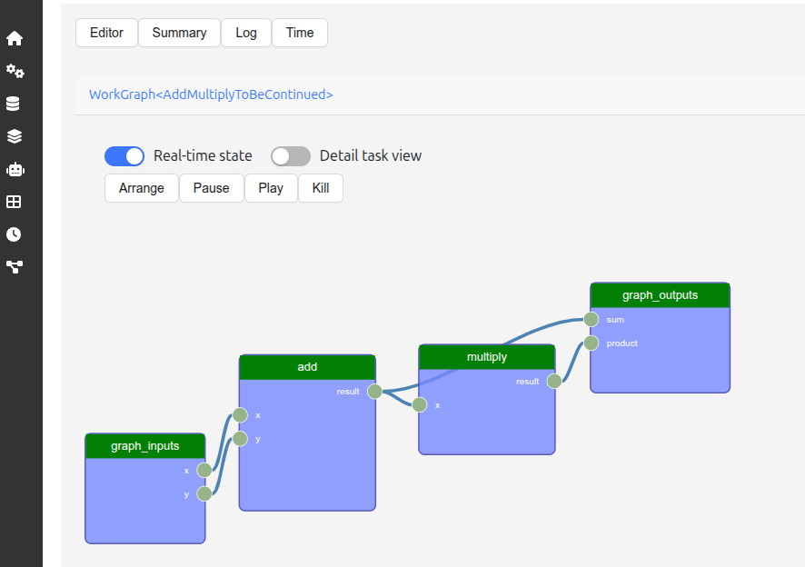

# AiiDA-WorkGraph
[](https://badge.fury.io/py/aiida-workgraph)
[](https://github.com/aiidateam/aiida-workgraph/actions/workflows/ci.yaml)
[](https://codecov.io/gh/aiidateam/aiida-workgraph)
[](http://aiida-workgraph.readthedocs.io/)

**A powerful Python library for creating, managing, and executing scalable scientific workflows with automatic data provenance.**


-----

## ✨ Why AiiDA-WorkGraph?

AiiDA-WorkGraph empowers researchers and developers to build complex, reproducible workflows with ease.

  - **🎨 Pythonic Workflow Design**: Define workflows using familiar Python functions and decorators.
  - **🖥️ Interactive GUI**: Visualize, monitor, and debug your workflows in real-time with a user-friendly web interface.
  - **🔗 Automatic Data Provenance**: Guarantee scientific reproducibility with zero effort. The complete history of all data and calculations is automatically tracked.
  - **🚀 Remote & Parallel Execution**: Seamlessly offload tasks to remote supercomputers and run them concurrently.
  - **🧠 Dynamic Control Flow**: Build adaptive workflows that respond to data at runtime using standard Python `if/else` statements and loops.
  - **🛡️ Checkpointing & Error Handling**: Protect long-running workflows from interruptions and build resilient logic to recover from failures.
  - **⚡ High-Throughput Computing**: Built to scale, AiiDA-WorkGraph can efficiently manage thousands of concurrent workflows.
  - **🧩 Reusable Components**: Encapsulate common routines as sub-workflows and easily reuse them in larger, more complex pipelines.

-----

## 🚀 Getting Started

### 1\. Installation

```console
pip install aiida-workgraph
```

First, ensure you have a working AiiDA environment.

```console
verdi presto  # Or 'verdi quicksetup' for a detailed setup
```

### 2\. Quick Start Example

Let's create a simple workflow to calculate $(x + y) \times z$.

**1️⃣ Define Tasks**

Use the `@task` decorator to turn Python functions into workflow components.

```python
from aiida_workgraph import task

@task
def add(x, y):
    """Adds two numbers."""
    return x + y

@task
def multiply(x, y):
    """Multiplies two numbers."""
    return x * y
```

**2️⃣ Compose a Workflow**

Use the `@task.graph` decorator to link tasks. Data flows naturally from one task's output to the next one's input.

```python
@task.graph
def add_multiply(x, y, z):
    """A workflow to add two numbers and then multiply by a third."""
    sum_result = add(x, y).result
    product_result = multiply(x=sum_result, y=z).result
    return product_result
```

**3️⃣ Run the Workflow**

Build the workflow with your inputs and run it.

```python
from aiida import load_profile

# Load your AiiDA profile
load_profile()

# Build and run the workflow
results = add_multiply.run(x=2, y=3, z=4)

# Print the final result
print(f"✅ Result: {results}")
# Expected output: ✅ Result: 20
```

**4️⃣ Automatic Provenance Tracking**

AiiDA-WorkGraph automatically generates a detailed provenance graph, tracking the full history of data and calculations to ensure full traceability and reproducibility.
Here is an example of the provenance graph generated for the above workflow:

</div>

<p align="center">

</p>


-----

## 🛠️ Flexible Workflow Construction

AiiDA-WorkGraph supports three complementary approaches to building workflows, letting you choose the best method for your needs.

  - **🐍 Pythonic Workflows (Recommended)**: Use `@task.graph` for clean, readable, and powerful workflows, as shown in the Quick Start.

  - **👁️ Visual Graph with Explicit Logic**: Use zones like `If`, `While`, and `Map` to build a graph where the control flow is visually explicit.

  - **⚙️ Low-Level Node-Graph Programming**: Programmatically define each task and link them manually for maximum control and dynamic graph generation.

-----


## 🖥️ Interactive GUI

Visualize, monitor, and debug your workflows in real-time. To launch the GUI, first install the package and then run:


```console
pip install aiida-gui-workgraph
aiida-gui start
```

Navigate to `http://127.0.0.1:8000/workgraph` in your web browser.

</div>

<p align="center">

</p>

> **Note:** The GUI is an experimental feature and is under active development.

-----

## 🔗 Useful Links

  - **📚 [Full Documentation](https://aiida-workgraph.readthedocs.io/en/latest/)**: Dive deep into all features and capabilities.
  - **🧪 [Demo & Examples Repository](https://github.com/superstar54/workgraph-collections)**: See real-world examples with various computational codes.
  - **🧑‍💻 [Development & Contribution](https://aiida-workgraph.readthedocs.io/en/latest/development/index.html)**: Learn how to contribute to the project.
  - **📄 [License](http://opensource.org/licenses/MIT)**: AiiDA-WorkGraph is licensed under the MIT License.
