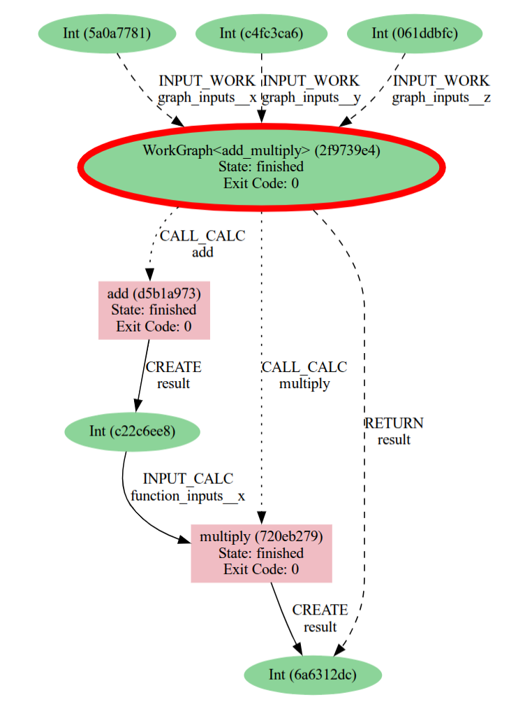

# AiiDA-WorkGraph
[](https://badge.fury.io/py/aiida-workgraph)
[](https://github.com/aiidateam/aiida-workgraph/actions/workflows/ci.yaml)
[](https://codecov.io/gh/superstar54/aiida-workgraph)
[](http://aiida-workgraph.readthedocs.io/)

Efficiently design and manage flexible workflows with AiiDA, featuring an interactive GUI, checkpoints, provenance tracking, and remote execution capabilities.


Here is a detailed comparison between the ``WorkGraph`` with two AiiDA built-in workflow components.


| Aspect                   | WorkFunction           | WorkChain                     | WorkGraph               |
| ------------------------ | ---------------------- | ----------------------------- | ---------------------- |
| Use Case                 | Short-running jobs     | Long-running jobs             | Long-running jobs      |
| Checkpointing            | ``No``                 | Yes                           | Yes                    |
| Execution order          | ``Sequential``         | ``Hybrid Sequential-Parallel``| Directed Acyclic Graph |
| Non-blocking             | ``No``                 | Yes                           | Yes                    |
| Implementation           | Easy                   | ``Difficult``                 | Easy                   |
| Dynamic                  | ``No``                 | ``No``                        | Yes                    |
| Ready to Use             | Yes                    | ``Need PYTHONPATH``           | Yes                    |
| Subprocesses Handling    | ``No``                 | Launches & waits              | Launches & waits       |
| Flow Control             | All                    | `if`, `while`                 | `if`, `while`, `match` |
| Termination              | ``Hard exit``          | ExitCode                      | ExitCode               |
| Data Passing             | Direct passing         | Context                       | Link & Context         |
| Output Recording         | Limited support        | Out & validates               | Out                    |
| Port Exposing            | Limited support        | Manual & automatic            | Manual                 |


## Installation

```console
    pip install aiida-workgraph
```

To install the latest version from source, first clone the repository and then install using `pip`:

```console
git clone https://github.com/aiidateam/aiida-workgraph
cd aiida-workgraph
pip install -e .
```

To install the jupyter widget support you need to in addition build the JavaScript packages:

```console
pip install .[widget]
# build widget
cd aiida_workgraph/widget/
npm install
npm run build
# build web frontend
cd ../../aiida_workgraph/web/frontend/
npm install
npm run build
```

## Documentation
Explore the comprehensive [documentation](https://aiida-workgraph.readthedocs.io/en/latest/) to discover all the features and capabilities of AiiDA Workgraph.

## Demo
Visit the [Workgraph Collections repository](https://github.com/superstar54/workgraph-collections) to see demonstrations of how to utilize AiiDA Workgraph for different computational codes.

## Examples
Suppose we want to calculate ```(x + y) * z ``` in two steps. First, add `x` and `y`, then multiply the result with `z`.

```python
from aiida.engine import calcfunction
from aiida_workgraph import WorkGraph

# define add calcfunction
@calcfunction
def add(x, y):
    return x + y

# define multiply calcfunction
@calcfunction
def multiply(x, y):
    return x*y

# Create a workgraph to link the tasks.
wg = WorkGraph("test_add_multiply")
wg.add_task(add, name="add1")
wg.add_task(multiply, name="multiply1")
wg.add_link(wg.tasks["add1"].outputs["result"], wg.tasks["multiply1"].inputs["x"])

```

Prepare inputs and submit the workflow:

```python
from aiida import load_profile

load_profile()

wg.submit(inputs = {"add1": {"x": 2, "y": 3}, "multiply1": {"y": 4}}, wait=True)
print("Result of multiply1 is", wg.tasks["multiply1"].outputs[0].value)
```

Start the web app, open a terminal and run:
```console
workgraph web start
```

Then visit the page http://127.0.0.1:8000/workgraph, you should find a `first_workflow` Worktree, click the pk and view the WorkGraph.


One can also generate the node graph from the process:
```console
verdi node generate pk
```




## Development

### Pre-commit and Tests
To contribute to this repository, please enable pre-commit so the code in commits are conform to the standards.
```console
pip install -e .[tests,pre-commit]
pre-commit install
```

### Widget
See the [README.md](https://github.com/aiidateam/aiida-workgraph/blob/main/aiida_workgraph/widget/README.md)

### Web app
See the [README.md](https://github.com/aiidateam/aiida-workgraph/blob/main/aiida_workgraph/web/README.md)


## License
[MIT](http://opensource.org/licenses/MIT)
