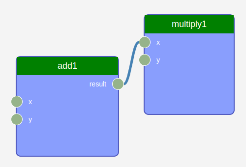

# AiiDA-WorkGraph
[](https://badge.fury.io/py/aiida-workgraph)
[](https://github.com/aiidateam/aiida-workgraph/actions/workflows/ci.yaml)
[](https://codecov.io/gh/aiidateam/aiida-workgraph)
[](http://aiida-workgraph.readthedocs.io/)

Efficiently design and manage flexible workflows with AiiDA, featuring an interactive GUI, checkpoints, provenance tracking, error-resistant, and remote execution capabilities.


## Installation

```console
    pip install aiida-workgraph
```

To install the latest version from source, first clone the repository and then install using `pip`:

```console
git clone https://github.com/aiidateam/aiida-workgraph
cd aiida-workgraph
pip install -e .
```


## Documentation
Explore the comprehensive [documentation](https://aiida-workgraph.readthedocs.io/en/latest/) to discover all the features and capabilities of AiiDA Workgraph.

## Demo
Visit the [Workgraph Collections repository](https://github.com/superstar54/workgraph-collections) to see demonstrations of how to utilize AiiDA Workgraph for different computational codes.

## Examples
Suppose we want to calculate ```(x + y) * z ``` in two steps. First, add `x` and `y`, then multiply the result with `z`.

```python
from aiida_workgraph import WorkGraph, task

# define add task
@task()
def add(x, y):
    return x + y

# define multiply task
@task()
def multiply(x, y):
    return x*y

# Create a workgraph to link the tasks.
wg = WorkGraph("test_add_multiply")
wg.add_task(add, name="add1")
wg.add_task(multiply, name="multiply1")
wg.add_link(wg.tasks.add1.outputs.result, wg.tasks.multiply1.inputs.x)

```

Prepare inputs and run the workflow:

```python
from aiida import load_profile

load_profile()

wg.run(inputs = {"add1": {"x": 2, "y": 3}, "multiply1": {"y": 4}})
print("Result of multiply1 is", wg.tasks.multiply1.outputs.result.value)
```
## Web ui
To use the web ui, first install the web ui package:
```console
pip install aiida-workgraph-web-ui
```
Then, start the web app with the following command:
```console

workgraph web start
```

Then visit the page http://127.0.0.1:8000/workgraph, you should find a `first_workflow` WorkGraph, click the pk and view the WorkGraph.




One can also generate the node graph from the process:
```console
verdi node generate pk
```


## Development

### Pre-commit and Tests
To contribute to this repository, please enable pre-commit so the code in commits are conform to the standards.
```console
pip install -e .[tests,pre-commit]
pre-commit install
```

## License
[MIT](http://opensource.org/licenses/MIT)
