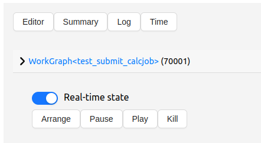

.. _topics:control:

*********************************************
How to control (pause, play, kill) the task
*********************************************

Command line
------------
You can control the task from the command line using the `workgraph` command. For example, to pause the task:

.. code-block:: bash

    workgraph task pause <workgraph_id> <task_name>

Graphical User Interface
------------------------
You can control the task from the graphical user interface. Click on the task and then click on the control buttons. You can pause, play, or kill the task.

