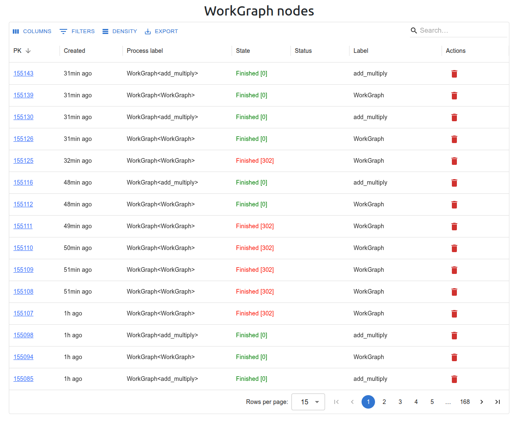
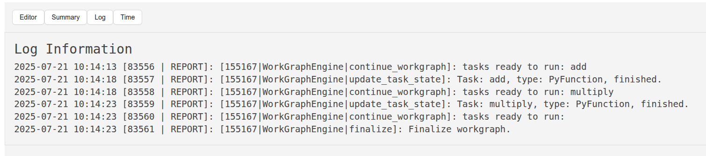
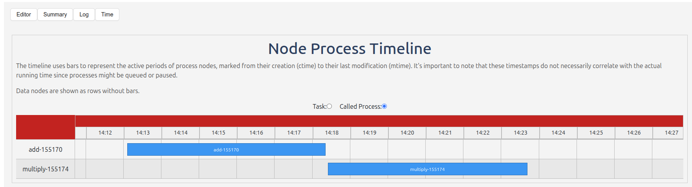
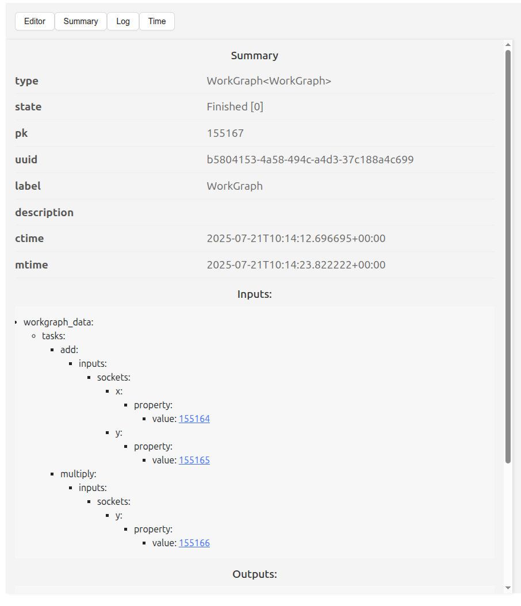
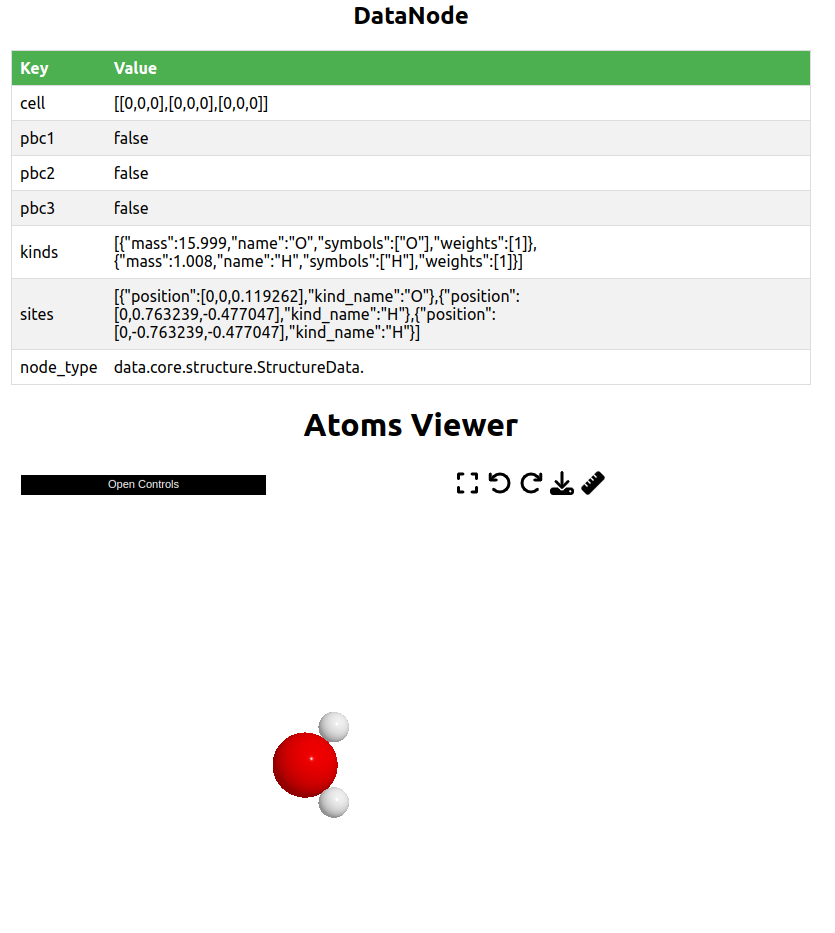

Use Web UI to view the WorkGraph
===============================
The web UI helps you to view and manage the workgraphs.

Start the web server
--------------------
Open a terminal, and run:

.. code-block:: bash

    workgraph web start

Then visit the page http://127.0.0.1:8000/workgraph, you can view all the workgraphs here.

Stop the web server
-------------------
Open a terminal, and run:

.. code-block:: bash

    workgraph web stop

WorkGraph table
---------------
The table shows all the workgraphs in the history. You can view the details of a workgraph by clicking it. You can also delete a workgraph by clicking the delete button.

WorkGraph detail
----------------
The detail page shows the details of a workgraph. You can view the details of each job in the workgraph. You can also view the logs of each job by clicking the log button.

.. image:: ../_static/images/web-detail.png

WorkGraph logs
--------------
The logs page shows the logs of a job. You can view the logs of a job here.

Timeline
--------

The timeline page shows the timeline of the execution of the workgraph. You can view the timeline of the workgraph here.

Text Summary
------------
The text summary page shows the text summary of the workgraph. You can view the text summary of the workgraph here.

DataNode detail
----------------

The DataNode detail page shows the details of a DataNode. For a structure, it will show the 3D structure.

