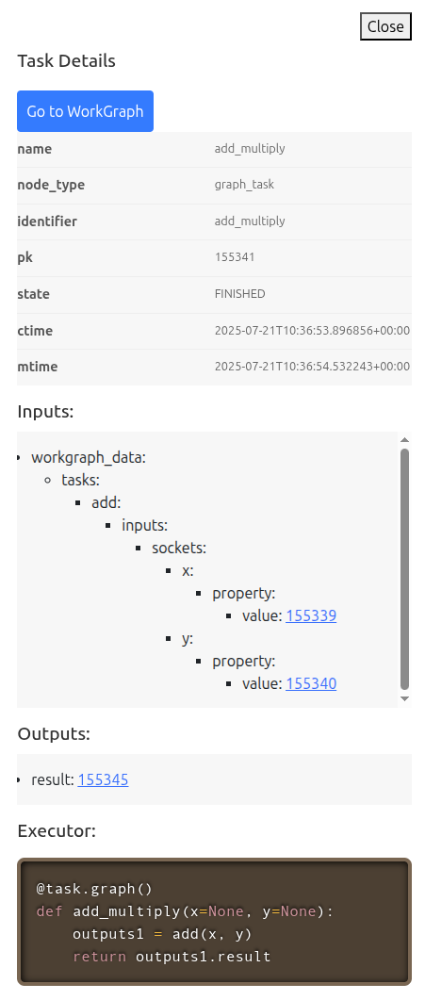
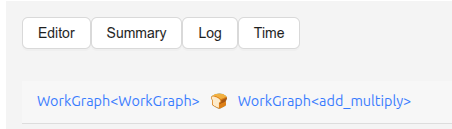
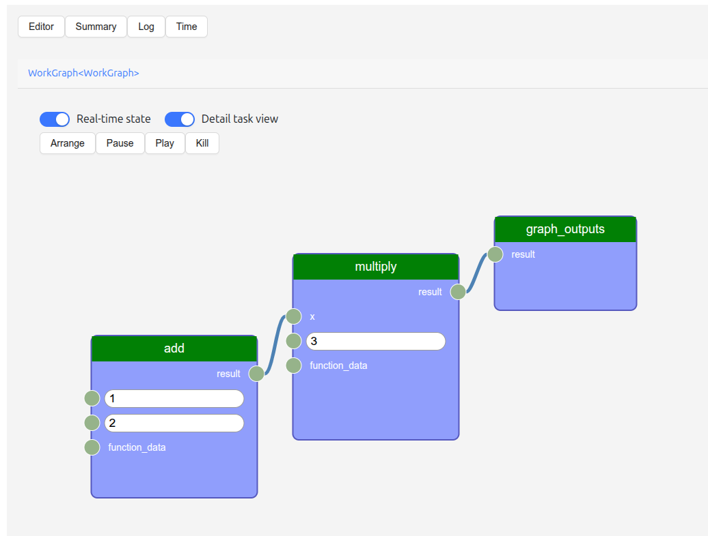

=================================
WorkGraph web UI
=================================

The **web UI** provides an intuitive interface to **view and manage WorkGraphs**.
This tutorial focuses on using the web UI to explore WorkGraphs.
For full details on the `aiida-gui` package, refer to the `aiida-gui documentation <https://aiida-gui.readthedocs.io/en/latest/>`_.

Installation
============

Install the web UI package via pip:

.. code-block:: bash

    pip install aiida-gui-workgraph

Start the web server
====================

To launch the web interface, run:

.. code-block:: bash

    aiida-gui start

Then open your browser and go to: http://127.0.0.1:8000/workgraph

WorkGraph table
===============

The main table displays all the WorkGraphs in your history. You can:

- **Click a WorkGraph** to view its details.
- **Delete** a WorkGraph using the trash icon.
- **Pause**, **play**, or **kill** running WorkGraphs.

.. image:: ../_static/images/web-job-management.png

WorkGraph detail view
=====================

Each WorkGraph has a detail view with four tabs:

- **Editor**: Visualizes the workflow graph. Inspect tasks and control execution (pause, play, kill).
- **Summary**: Displays a summary of the process, including inputs, outputs, and called processes.
- **Logs**: Shows the logs of the WorkGraph.
- **Timeline**: Displays the task execution timeline.

Editor tab
----------

This tab shows the workflow graph. Click on a task to see its inputs and outputs.

.. image:: ../_static/images/web-detail.png

Logs
----

The Logs tab shows real-time and historical logs for the WorkGraph process.

.. image:: ../_static/images/web-logs.png

Timeline
--------

This tab visualizes when each task was executed, helping to analyze task durations and dependencies.

.. image:: ../_static/images/web-timeline.png

Summary
-------

The Summary tab provides a structured overview of the WorkGraph, including input/output metadata and called processes.

.. image:: ../_static/images/web-summary.png

Task details
============

Clicking a task in the graph opens a detail panel on the right. This panel shows:

- A summary of the task process
- The task's inputs and outputs
- The source code of the task

.. _web-ui:nested-workgraphs:

Nested WorkGraphs
=================

If the task is itself a WorkGraph (e.g., a ``Graph`` or ``WorkGraph`` task), a **Go to WorkGraph** button appears in the task detail panel.
Clicking this navigates to the sub-WorkGraph.

A breadcrumbs navigation bar appears at the top, showing the current and parent WorkGraphs.

.. _web-ui:detailed-socket-view:

Detailed socket view
====================

Enable the **Detail task view** toggle to see the actual values of inputs and outputs for each task directly in the graph view.

Conclusion
==========

In this tutorial, we demonstrated how to use the web UI to:

- View all existing WorkGraphs
- Navigate through and inspect tasks and sub-workflows
- Analyze task logs, timelines, and summaries
- Interactively control task execution
