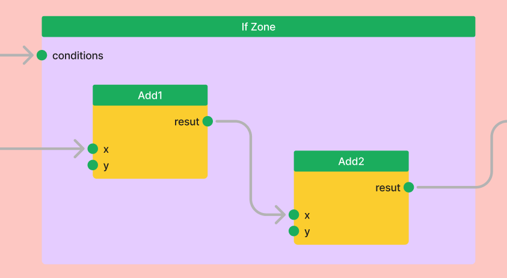

========
Overview
========

Flexible workflow construction
==============================
AiiDA-WorkGraph supports three complementary approaches to building workflows, whether you prefer writing clean Python code, visualizing complex logic, or exercising low-level control. This flexibility lets you choose the method that best fits your project and working style.

1. Pythonic workflows
-------------------
Define entire workflows using standard Python functions and intuitive decorators. This approach is ideal for developers who prefer expressing logic directly in code, enabling rapid prototyping, automation, and easy integration into larger Python applications.

.. code-block:: python

    from aiida_workgraph import task

    # Define individual tasks with the @task decorator
    @task
    def add(x, y):
        return x + y

    @task
    def multiply(x, y):
        return x * y

    # Compose tasks into a workflow using the @task.graph decorator
    @task.graph()
    def add_multiply(x, y, z):
        if x > 0:
            return add(x, y).result
        else:
            return multiply(x, y).result

    # Run the workflow
    add_multiply.run(x=2, y=3, z=4)

2. Visual graph with explicit logic
---------------------------------
For those who prefer to visualize control flow, AiiDA-WorkGraph offers zone-based construction. Use explicit zones like ``If``, ``While``, and ``Map`` to build a graph that clearly shows the workflow's structure and dependencies. This avoids hiding logic inside "black-box" Python functions and makes complex workflows easier to understand.

.. code-block:: python

    from aiida_workgraph import If

    with If(x > 0) as if_zone:
        add1 = add(x=x, y=y).result
        add2 = add(x=add1, y=z).result

3. Low-Level node-graph programming
---------------------------------
For maximum control, you can construct a workflow by programmatically defining each task and connecting their inputs and outputs (links). While more verbose, this method is invaluable for advanced use cases, such as programmatically generating a graph's structure.
See: `Node-graph programming <./howto/autogen/node_graph_programming.rst>`_

.. code-block:: python

    from aiida_workgraph import WorkGraph

    wg = WorkGraph("test_add_multiply")
    wg.add_task(add, name="add1")
    wg.add_task(multiply, name="multiply1")
    wg.add_link(wg.tasks.add1.outputs.result, wg.tasks.multiply1.inputs.x)

Key features
==============

Powerful execution capabilities
-------------------------------

* **Remote execution**: Seamlessly offload tasks to remote supercomputers. AiiDA-WorkGraph handles the details of connecting and running shell commands or Python functions on any configured machine.

    .. code-block:: python

        from aiida_workgraph import shelljob

        remote_computer = orm.load_computer("remote_computer_label")

        outputs = shelljob(
            command="date", # The command to execute
            metadata={"computer": remote_computer},
        )

* **Parallel tasks**: Effortlessly launch and manage multiple tasks in parallel without writing complex concurrency code. AiiDA-WorkGraph handles the scheduling and data collection.

    .. code-block:: python

        @task.graph()
        def parallel_add(x, N):
            results = {}
            # Launch N parallel tasks to add x with each index
            for i in range(N):
                results[f"add_{i}"] = add(x, i).result
            return results

* **High-throughput computing**: Built to scale, AiiDA-WorkGraph can efficiently manage thousands of concurrent workflows, making it ideal for large-scale screening studies and data-intensive computations.

Robustness and reproducibility
-------------------------------

* **Automatic provenance**: Guarantee scientific reproducibility with zero effort. AiiDA-WorkGraph automatically tracks the complete history of all data and calculations, creating a detailed provenance graph that ensures full traceability.

    .. image:: ./_static/images/data_provenance_example.png

* **Checkpointing**: Protect long-running workflows from interruptions. AiiDA-WorkGraph can save a workflow's state at any point and resume execution from the last checkpoint, saving valuable time and computational resources.

* **Advanced error handling**: Build resilient workflows that can recover from failures. Define custom handlers to respond to specific exit codes, allowing your workflow to retry a failed task, branch to a cleanup routine, or exit gracefully.

    The example below shows a workflow recovering from an initial task failure (exit code `410`) and completing successfully.

    .. code-block:: console

        WorkGraph<handling_error_negative_number><968> Finished [0]
            ├── ArithmeticAddCalculation<971> Finished [410]
            └── ArithmeticAddCalculation<977> Finished [0]

Advanced control and modularity
-------------------------------

* **Dynamic workflow**: Build adaptive workflows that respond to data at runtime. Use standard Python ``if/else`` statements, ``while`` loops (via recursion), and other control structures to dynamically alter the execution path.

    .. code-block:: python

        # 'if' condition example
        @task.graph()
        def conditional_workflow(x):
            if x > 0:
                return add(x, 10).result
            else:
                return multiply(x, 10).result

* **Reusable workflows**: Don't reinvent the wheel. Encapsulate common routines as sub-workflows and easily reuse them in larger, more complex pipelines to build modular and maintainable solutions.

    .. code-block:: python

        @task.graph()
        def main_workflow(x, y):
            sum1 = add(x, y).result
            # Call the reusable add_multiply workflow
            result1 = add_multiply(sum1, 2, 3).result
            return result1

* **Event-driven execution**: Trigger tasks based on external events for truly adaptive workflows. Monitor for conditions like the arrival of a file or a specific time, enabling integration with real-time data streams or experimental facilities.

    .. code-block:: python

        @task.monitor
        def time_monitor(time):
            """This task waits until a specified time has passed."""
            import datetime
            return datetime.datetime.now() > datetime.datetime.fromisoformat(time.value)

Intuitive user experience
-------------------------

* **Interactive GUI**: Visualize, monitor, and debug your workflows in real-time with a user-friendly web interface. Inspect the graph, check task statuses, and dive into the details of any calculation.

    .. image:: ./_static/images/web-detail.png

What's Next?
============

Explore the following resources to begin your journey with AiiDA-WorkGraph:

+---------------------------------------------+------------------------------------------------------+
| `Quick Start <./autogen/quick_start.rst>`__ | Get up and running with a simple workflow example.   |
+---------------------------------------------+------------------------------------------------------+
| `Concepts <./concept/index.rst>`__          | Learn the core concepts behind AiiDA-WorkGraph.      |
+---------------------------------------------+------------------------------------------------------+
| `Tutorials <./tutorial/index.rst>`__        | Discover real-world examples in computational        |
|                                             | materials science and other domains.                 |
+---------------------------------------------+------------------------------------------------------+
| `How-To Guides <./howto/index.rst>`__       | Master advanced topics like control flow with        |
|                                             | ``if``, ``for``, ``while``, and ``context``.         |
+---------------------------------------------+------------------------------------------------------+
| `GUI <./gui/index.rst>`__                   | Use the web UI to explore WorkGraphs                 |
+---------------------------------------------+------------------------------------------------------+
